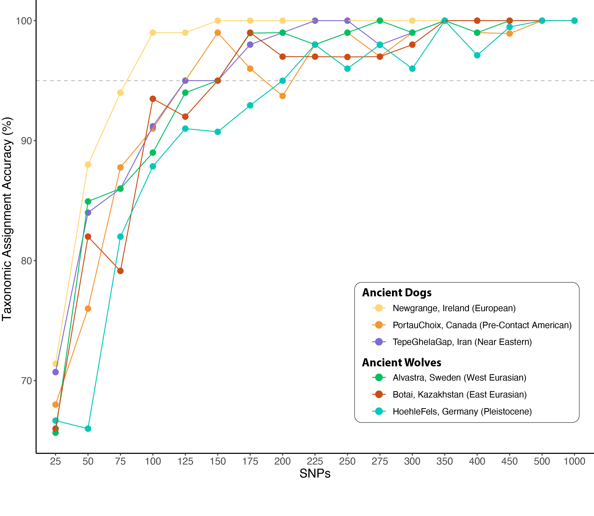

# CanID: Accurate discrimination of ancient dogs and wolves

## **Introduction**
`CanID` is a `snakemake` workflow which takes low-pass (i.e. screening) sequencing data as input, and accurately determines the taxonomic status of each sample (i.e. dog or wolf), as well as calculating a suite of summary statistics. With as few as 500 SNPs (Fig. 1), `CanID` is 100% accurate at distinguishing all dogs and wolves (both modern and ancient), including pre-contact American dogs and extinct Pleistocene wolves, whose ancestry is largely unrepresented in contemporary canid populations.


**Figure 1.** Benchmarking of CanID using published ancient dogs and wolves, representative of all modern diversity. For each sample, a given number of SNPs (between 25–1,000) were randomly sampled from pseudohaploidized genomes, and run through the workflow's identification module. Accuracy of taxonomic assignment was averaged over 100 replicates for each given number of SNPs.

## **Setup**
### **Install Snakemake**

**1.** Install the [Miniconda](https://docs.anaconda.com/free/miniconda/#quick-command-line-install) package manager following the command line installation for your operating system:

**For Linux/MacOS:**
```
mkdir -p ~/miniconda3
wget https://repo.anaconda.com/miniconda/Miniconda3-latest-Linux-x86_64.sh -O ~/miniconda3/miniconda.sh
bash ~/miniconda3/miniconda.sh -b -u -p ~/miniconda3
rm -rf ~/miniconda3/miniconda.sh
```
**For Windows:**
```
curl https://repo.anaconda.com/miniconda/Miniconda3-latest-Windows-x86_64.exe -o miniconda.exe
start /wait "" miniconda.exe /S
del miniconda.exe
```

**2.** Install [snakemake](https://snakemake.readthedocs.io/en/stable/) using conda:

```
conda install -n snakemake snakemake
```

**3.** Activate the environment:

```
conda activate snakemake
```

### **Clone the CanID repository**


### **Download Reference Genome**
Genotypes were called against the canFam3.1 reference genome assembly
`wget https://ftp.ncbi.nlm.nih.gov/genomes/all/GCA/000/002/285/GCA_000002285.4_Dog10K_Boxer_Tasha/GCA_000002285.4_Dog10K_Boxer_Tasha_genomic.fna.gz`

Index the reference genome:

```
bwa index
```

### **Quick Start**
`CanID` requires two user-modified files to run, both located in the `config` directory:

**1.** `user_config.yaml` – used to set the run name, and specify the paths to both the `sample_file_list.tsv`, and the downloaded dog reference genome (canFam3.1). There are also optional parameters that can be modified.

**2.** `sample_file_list.tsv` – provides a list of library names, sample names, and paths to the paired-end sequencing reads (which must have either a .fq or .fastq suffix)

| Library_Name | Sample_Name | Path |
|-----------|-----|--------|
| LS0001_1 | NZ_Dog | path/to/directory/with/files |
| LS0001_2 | NZ_Dog | path/to/directory/with/files/ |
| LS0002 | Australia_Dog | path/to/directory/with/files/ |

The `Sample_Name` column can be used to combine reads from the same individual across multiple lanes or sequencing runs, or simply to change the name of the files generated (must be <39 characters).
Please note, that a header **must not be included** in the `sample_file_list.tsv`. 

```
snakemake --unlock
snakemake --use-conda --cores 40
```

### **Pipeline Configuration and Specifics**


INPUT

Reference panel containing 2 million biallelic transversional SNPs that distinguish dogs and wolves.

Sites used in SNP capture, filtered for maf (0.01)


## **Report Errors**


## **Citation**

## **References**
Bergstrom et al. 2022
