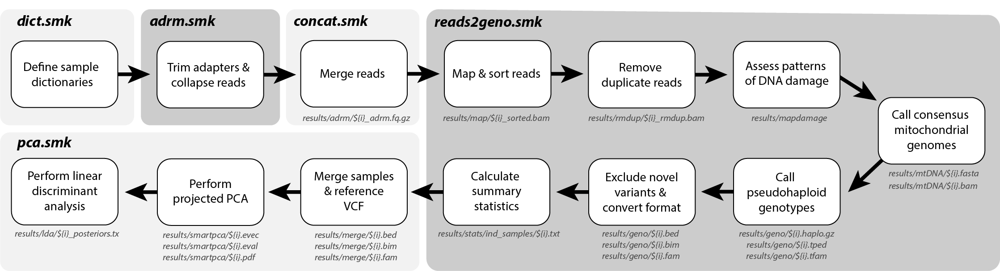

# CanID: Accurate discrimination of ancient dogs and wolves

## **Introduction**
`CanID` takes low-pass (i.e. screening) sequencing data as input, and accurately determines the taxonomic status of each sample (i.e. dog or wolf), as well as calculating a suite of summary statistics. With as few as 500 SNPs (Fig. 1), `CanID` is 100% accurate at distinguishing all dogs and wolves (both modern and ancient), including pre-contact American dogs and extinct Pleistocene wolves, whose ancestry is largely unrepresented in contemporary canid populations.

## **Workflow Overview**

<br>
<br>

## **Setup**
### **Install Snakemake using Conda**
`CanID` utilises the `snakemake` workflow. The following three steps outline the installation of `snakemake` using the package manager `conda`:

**1.** Install the [Miniconda](https://docs.anaconda.com/free/miniconda/#quick-command-line-install) package manager (if required) following the command line installation for your operating system:

**For Linux/MacOS:**
```
mkdir -p ~/miniconda3
wget https://repo.anaconda.com/miniconda/Miniconda3-latest-Linux-x86_64.sh -O ~/miniconda3/miniconda.sh
bash ~/miniconda3/miniconda.sh -b -u -p ~/miniconda3
rm -rf ~/miniconda3/miniconda.sh
```
**For Windows:**
```
curl https://repo.anaconda.com/miniconda/Miniconda3-latest-Windows-x86_64.exe -o miniconda.exe
start /wait "" miniconda.exe /S
del miniconda.exe
```

**2.** Install [snakemake](https://snakemake.readthedocs.io/en/stable/) using conda:

```
conda install -n snakemake snakemake
```

**3.** Activate the environment:

```
conda activate snakemake
```

### **Clone the CanID repository**
All of the rules, scripts, and environments required by this `snakemake` workflow can be downloaded from the `CanID` repository as follows: 
```
git clone https://github.com/lachiescarsbrook/CanID.git
cd CanID
```

### **Download the Reference Genome and SNP Panel**
As the genotypes in the reference panel were called against the [CanFam3.1](https://www.ncbi.nlm.nih.gov/datasets/genome/GCF_000002285.5) dog genome assembly, and the workflow utilises the Y-chromosome for sex determination (which is absent from the original assembly), we have released a custom `canFam3_withY.fa` reference genome. To download, ensure you are in the `CanID` directory, and use the following:

```
TAG="1.0"

wget https://github.com/lachiescarsbrook/CanID/releases/download/$TAG/canFam3_withY.fa.gz workflow/files/canFam3_withY.fa.gz
gunzip workflow/files/canFam3_withY.fa.gz
```
**Note:** `TAG` should reflect the most up-to-date release, which can be found [here](https://github.com/lachiescarsbrook/CanID/tags).   
<br>

The `canFam3_withY.fa` reference genome must then be indexed using [`bwa`](https://academic.oup.com/bioinformatics/article/25/14/1754/225615), which can be installed using conda:

```
conda install -n bwa bwa
conda activate bwa
bwa index workflow/files/canFam3_withY.fa
conda deactivate bwa
```
<br>

We have also released a reference panel (in binary PLINK format) containing 2,011,237 biallelic transversional SNPs, which is used to determine the taxonomic status of each sample through a combination of PCA projection and discriminant function analysis. To download, ensure you are still in the `CanID` directory, and use the following:

```
TAG="1.0"

https://github.com/lachiescarsbrook/CanID/releases/download/$TAG/dog_wolf_panel_2M.bed workflow/files/dog_wolf_panel_2M.bed
https://github.com/lachiescarsbrook/CanID/releases/download/$TAG/dog_wolf_panel_2M.bim workflow/files/dog_wolf_panel_2M.bim
https://github.com/lachiescarsbrook/CanID/releases/download/$TAG/dog_wolf_panel_2M.fam workflow/files/dog_wolf_panel_2M.fam
https://github.com/lachiescarsbrook/CanID/releases/download/$TAG/sites_2M workflow/files/sites_2M
https://github.com/lachiescarsbrook/CanID/releases/download/$TAG/sites_2M.bin workflow/files/sites_2M.bin
https://github.com/lachiescarsbrook/CanID/releases/download/$TAG/sites_2M.idx workflow/files/sites_2M.idx
```
You are now ready to run `CanID`!
<br>
<br>

## **Quick Start**
The `CanID` workflow requires parameters specified in two user-modified files to run, both of which are located in the `config` directory:


**1.** `user_config.yaml`: used to set the `Run Name`, and specify the paths to both the `sample_file_list.tsv` and the custom `canFam3_withY.fa` reference genome. There are other optional parameters that can be modified.


**2.** `sample_file_list.tsv`: provides a list of library names, sample names, and paths to the paired-end sequencing reads (which must have either the .fq.gz or .fastq.gz suffix)


| Library Name | Sample Name | Path |
|-----------|-----|--------|
| LS0001_A1 | NZ_Dog | path/to/directory/with/reads |
| LS0001_A2 | NZ_Dog | path/to/directory/with/reads |
| LS0002 | Australia_Dog | path/to/directory/with/reads |

The `Library Name` string must exatcly match the ID found in the name of the paired-end files (e.g. LS0001_A1_L001.fastq.gz). The `Sample Name` column can be used to combine reads from the same individual across multiple lanes or libraries, or simply to change the name of the files generated (must be <39 characters). 

**Note:** a header **must not be included** in the `sample_file_list.tsv`. 

Once the user-specific parameters have been specified in the `user_config.yaml` and `sample_file_list.tsv`, the workflow, which is defined in the `Snakefile`, can be executed using the following:

```
snakemake --unlock
snakemake --use-conda --cores 40
```
**Note:** the number of cores can be altered to maximise available CPU.
<br>
<br>

## **Benchmarking**
 
**Figure 1.** Benchmarking of CanID using published ancient dogs and wolves, representative of all modern diversity. For each sample, a given number of SNPs (between 25–1,000) were randomly sampled from pseudohaploidized genomes, and run through the workflow's identification module. Accuracy of taxonomic assignment was averaged over 100 replicates for each given number of SNPs.
<br>
<br>

## **Output**

### **Taxonomic Assignment**
`CanID` generates a principal components plot, which is stored in the `results/smartpca` directory (`Run Name`_PCA_plot.pdf). This is constructed in `smartpca` from a diverse reference panel of 165 dogs and 80 wolves, onto which unknown samples are projected through eigenvector multiplication. Taxonomic status is then determined through discriminant function analysis using the first 10 principal components, with the output stored in the `results/lda/` directory (`Run Name`_posteriors.txt).

### **Sample Summary Statistics**
For each `Sample`, the following statistics are also calculated, with the output stored in the `results/stats/` directory:
<br>
- `Total_Reads`: number of collapsed reads. 
- `Mapped_Reads_NoDup`: percentage of collapsed reads which mapped to the reference genome, excluding PCR duplicates. 
- `Mapped_Reads_Q30_NoDup`: percentage of collapsed reads which mapped to the reference genome, excluding PCR duplicates and reads with mapping quality <30.
- `Duplicates`: proportion of reads representing PCR duplicates.
- `Autosomal_Coverage`: mean breadth of coverage across autosomes (chr1–38).
- `Autosome-X_Depth_Ratio`: calculated by dividing the mean autosome (chr1-38) depth of coverage, by the X-chromosome depth of coverage. Expected coverage ratios are ~0.5 for males (XY), and ~1.0 for females (XX), given variable X-chromosome copy number. 
- `Y_Coverage`: Y-chromosome breadth of coverage. 
- `mtDNA_Reads`: number of collapsed reads which map to the mitochondrial genome.
- `mtDNA_Depth`: average depth of coverage across the mitochondrial genome.
- `mtDNA_Breadth`: average breadth of coverage across the mitochondrial genome.
- `SNPs`: number of pseudohaploid SNPs called.
- `Mapped_Length_Mean` `Mapped_Length_SD`: mean length and standard deviation of mapped collapsed reads.
- `All_Length_Mean` `All_Length_SD`: mean length and standard deviation of all collapsed reads.
- `C-toT`: proportion of 5' C-to-T nucleotide substitutions.
- `G-to-A`: proportion of 3' G-to-A nucleotide substitutions.
<br>
<br>

## **Report Errors**
<br>

## **Citation**

