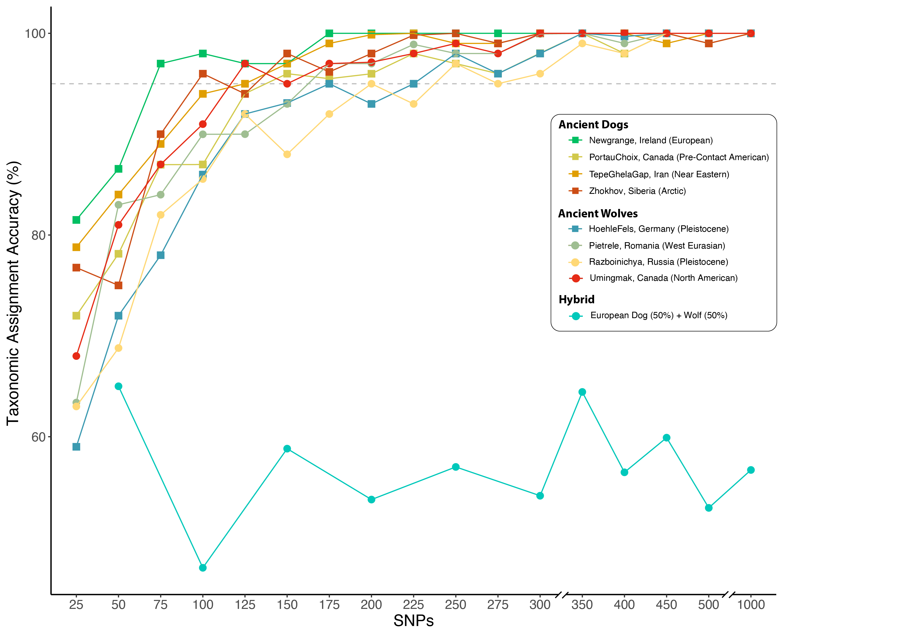
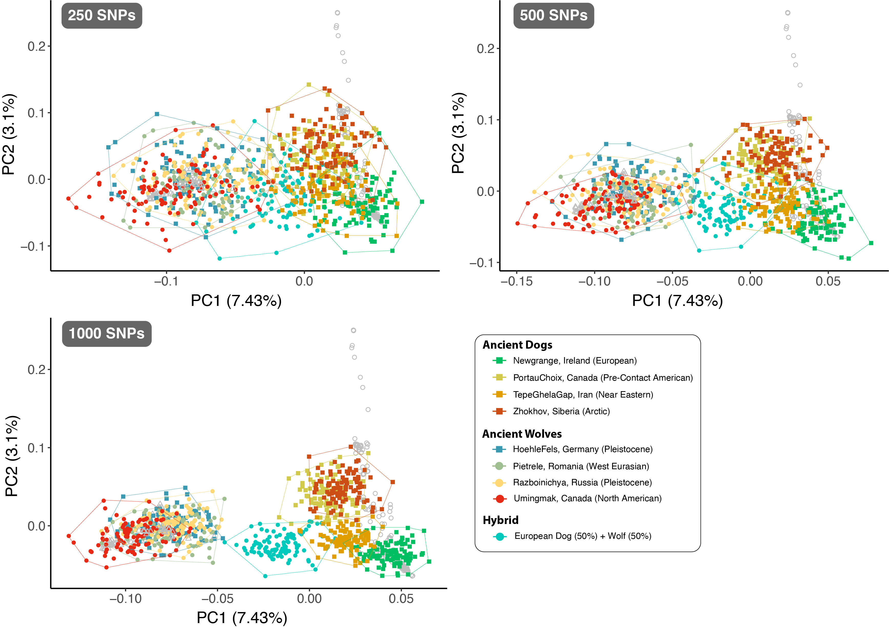

# CanID: Accurate discrimination of ancient dogs and wolves

## **Introduction**
The canid identification (`CanID`) workflow takes low-pass (i.e. screening) sequencing data as input, and accurately determines the taxonomic status of each sample (i.e. dog or wolf), as well as calculating a suite of summary statistics (Fig. 1). With as few as 500 SNPs (Fig. 2), `CanID` is 100% accurate at distinguishing all dogs and wolves (both modern and ancient), including pre-contact American dogs and extinct Pleistocene wolves, whose ancestry is largely unrepresented in contemporary canid populations. Recent dog-wolf hybrids can also be identified (Fig. 3).

## **Citation**
The manuscript which presents `CanID` is currently in preparation. In the meantime, please cite this workflow as follows: 
- Scarsbrook, L. 2024. Canid Identification (CanID) Workflow. GitHub. https://github.com/lachiescarsbrook/CanID.

## **Workflow Overview**

**Figure 1.** Overview of the `CanID` workflow, showing the function and output of each `snakemake` rule contained within the five modules.
<br>
<br>

## **Setup**
### **Install Snakemake using Conda/Mamba**
`CanID` utilises the `snakemake` workflow. The following four steps outline the installation of `snakemake` using the package managers `conda` and `mamba`.

- **1.** Install the [Miniconda](https://docs.anaconda.com/free/miniconda/#quick-command-line-install) package manager (if required) following the command line installation for your operating system. 

- **2.** Install [`mamba`](https://mamba.readthedocs.io/en/latest/installation/mamba-installation.html) using `conda`:
```
conda install -n base -c conda-forge mamba
```

- **3.** Install [`snakemake`](https://snakemake.readthedocs.io/en/stable/getting_started/installation.html) using `mamba`:

```
mamba create -c conda-forge -c bioconda -n snakemake snakemake
```

- **4.** Activate the environment:

```
mamba activate snakemake
```

### **Clone the CanID repository**
All of the rules, scripts, and environments required by this `snakemake` workflow can be downloaded from the `CanID` repository as follows: 
```
git clone https://github.com/lachiescarsbrook/CanID.git
cd CanID
```

To make all rules and scripts executable, permissions must be changed using:
```
chmod -R 770 workflow
```

### **Install ANGSD**
While most programs utilised by `CanID` can be installed through `mamba`, a direct download of the genotyping tool [`angsd`](https://www.popgen.dk/angsd/index.php/ANGSD) is required to ensure the workflow is compatible with both Lunix/MacOS operating systems:
```
cd workflow
git clone https://github.com/ANGSD/angsd.git 
cd angsd
git checkout 0.941
make
cd ../../
```

### **Download and Index the Reference Genome**
As the genotypes in the reference panel were called against the [CanFam3.1](https://www.ncbi.nlm.nih.gov/datasets/genome/GCF_000002285.5) dog genome assembly, and the workflow utilises the Y-chromosome for sex determination (which is absent from the original assembly), we have released a custom `canFam3_withY.fa` reference genome. To download, ensure you are in the `CanID` directory, and use the following:

```
TAG="1.0"

wget https://github.com/lachiescarsbrook/CanID/releases/download/$TAG/canFam3_withY.fa.gz -O ./workflow/files/canFam3_withY.fa.gz
gunzip workflow/files/canFam3_withY.fa.gz
```
**Note:** `TAG` should reflect the most up-to-date release, which can be found [here](https://github.com/lachiescarsbrook/CanID/tags).   
<br>

The `canFam3_withY.fa` reference genome must then be indexed using [`bwa`](https://academic.oup.com/bioinformatics/article/25/14/1754/225615), which can be installed using `mamba`:

```
mamba create -c bioconda -n bwa bwa
mamba activate bwa
bwa index workflow/files/canFam3_withY.fa
mamba deactivate bwa
```

### **Download the 2M SNP Panel**
We have also released a reference panel (in binary PLINK format) containing 2,011,237 biallelic transversional SNPs, which is used to determine the taxonomic status of each sample through a combination of PCA projection and discriminant function analysis. To download, ensure you are still in the `CanID` directory, and use the following:

```
TAG="1.0"

wget https://github.com/lachiescarsbrook/CanID/releases/download/$TAG/dog_wolf_panel_2M.bed -O ./workflow/files/dog_wolf_panel_2M.bed
wget https://github.com/lachiescarsbrook/CanID/releases/download/$TAG/dog_wolf_panel_2M.bim -O ./workflow/files/dog_wolf_panel_2M.bim
wget https://github.com/lachiescarsbrook/CanID/releases/download/$TAG/dog_wolf_panel_2M.fam -O ./workflow/files/dog_wolf_panel_2M.fam
wget https://github.com/lachiescarsbrook/CanID/releases/download/$TAG/sites_2M -O ./workflow/files/sites_2M
wget https://github.com/lachiescarsbrook/CanID/releases/download/$TAG/sites_2M.bin -O ./workflow/files/sites_2M.bin
wget https://github.com/lachiescarsbrook/CanID/releases/download/$TAG/sites_2M.idx -O ./workflow/files/sites_2M.idx
```
You are now ready to run `CanID`!
<br>
<br>

## **Quick Start**
The `CanID` workflow requires parameters specified in two user-modified files to run, both of which are located in the `config` directory:


**1.** `user_config.yaml`: used to set the `Run Name`, and specify the paths to both the `sample_file_list.tsv` and the custom `canFam3_withY.fa` reference genome (only the first parameter is required). There are other optional parameters that can be modified.


**2.** `sample_file_list.tsv`: provides a tab- or space-delimited list of library names, sample names, and paths to the paired-end sequencing reads (which must have either the .fq.gz or .fastq.gz suffix)


| Library Name | Sample Name | Path |
|-----------|-----|--------|
| LS0001_A1 | NZ_Kuri | path/to/directory/with/reads |
| LS0001_A2 | NZ_Kuri | path/to/directory/with/reads |
| LS0002 | Australian_Dingo | path/to/directory/with/reads |

The `Library Name` string must exatcly match the ID found in the name of the paired-end files (e.g. LS0001_A1_L001.fastq.gz). The `Sample Name` column can be used to combine reads from the same individual across multiple lanes or libraries, or simply to change the name of the files generated (must be <39 characters). 

**Note:** a header **must not be included** in the `sample_file_list.tsv`. 

Once the user-specific parameters have been specified in the `user_config.yaml` and `sample_file_list.tsv`, the workflow, which is defined in the `Snakefile`, can be executed using the following:

```
snakemake --unlock
snakemake --use-conda --cores 40
```
**Note:** the number of cores can be altered to maximise available CPU.
<br>
<br>

## **Output**

### **Taxonomic Assignment**
`CanID` generates a principal components plot, which is stored in the `results/smartpca` directory (`Run Name`_PCA_plot.pdf). This is constructed in `smartpca` from a diverse reference panel of 165 dogs and 80 wolves, onto which unknown samples are projected through eigenvector multiplication. Taxonomic status is then determined through discriminant function analysis using the first 10 principal components, with the output stored in the `results/lda/` directory (`Run Name`_posteriors.txt).

### **Sample Summary Statistics**
For each `Sample`, the following statistics are also calculated, with the output stored in the `results/stats/` directory:
<br>
- `Total_Reads`: number of collapsed reads. 
- `Mapped_Reads_NoDup`: percentage of collapsed reads which mapped to the reference genome, excluding PCR duplicates. 
- `Mapped_Reads_Q30_NoDup`: percentage of collapsed reads which mapped to the reference genome, excluding PCR duplicates and reads with mapping quality <30.
- `Duplicates`: percentage of reads representing PCR duplicates.
- `Autosomal_Coverage`: mean breadth of coverage (x) across autosomes (chr1–38).
- `Autosome-X_Depth_Ratio`: calculated by dividing the mean autosome (chr1-38) depth of coverage, by the X-chromosome depth of coverage. Expected coverage ratios are ~0.5 for males (XY), and ~1.0 for females (XX), given variable X-chromosome copy number. 
- `Y_Coverage`: Y-chromosome breadth of coverage (x). 
- `mtDNA_Reads`: number of collapsed reads which map to the mitochondrial genome.
- `mtDNA_Depth`: average depth of coverage across the mitochondrial genome.
- `mtDNA_Breadth`: average breadth of coverage across the mitochondrial genome.
- `SNPs`: number of pseudohaploid SNPs called.
- `Mapped_Length_Mean` `Mapped_Length_SD`: mean length and standard deviation of mapped collapsed reads.
- `All_Length_Mean` `All_Length_SD`: mean length and standard deviation of all collapsed reads.
- `C-toT`: percentage of 5' C-to-T nucleotide substitutions.
- `G-to-A`: percentage of 3' G-to-A nucleotide substitutions.

## **Benchmarking**
To test the accuracy of `CanID` in distinguishing dogs and wolves, we selected published ancient genomes which captured the range of extant/extinct diversity across the species (Fig. 2). For each individual, we generated pseudohaploidized genomes (to mimic the genotype calling in `CanID`), and selected a specified subset of SNPs (between 25–1000) to test the workflows identification module, with 100 replicates for each given number of SNPs. We also tested the classification of individuals with mixed ancestry by generating a F1 hybrid, taking 50% of SNPs from the ancient European dog (i.e. Newgrange), and 50% from the ancient West Eurasian wolf (i.e. Pietrele).


**Figure 2.** Accuracy of `CanID` taxonomic assignment, averaged over 100 replicates for each given number of SNPs.
<br>
<br>


**Figure 3.** Principal components plots generated through `CanID` benchmarking for 250, 500 and 1000 SNPs. 
<br>
<br>
